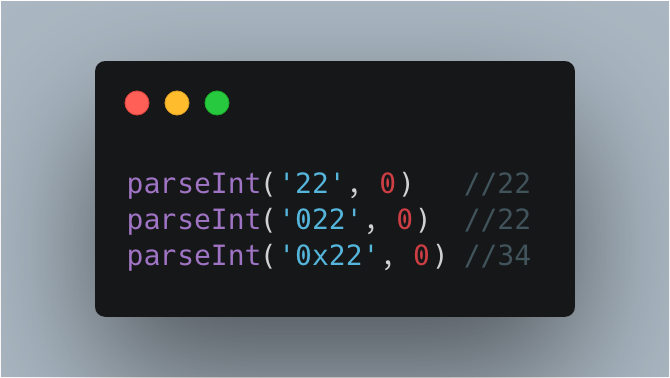

### 每日一题
```js
['1', '2', '3'].map(parseInt)
```
<details>
<summary>会输出什么结果？</summary>

- 此题分别弄懂 `map` 及 `parseInt` 的几个参数即可
  - https://developer.mozilla.org/zh-CN/docs/Web/JavaScript/Reference/Global_Objects/parseInt
  - https://developer.mozilla.org/en-US/docs/Web/JavaScript/Reference/Global_Objects/Array/map
- `parseInt` 接收两个参数，第一个是需要转化的值，第二个是转换成整数的基数
- `map` 第一个参数为一个回调函数，该回调函数的参数分别为：数组当前遍历值，当前值的 index, 当前数组
- 备注

</details>
