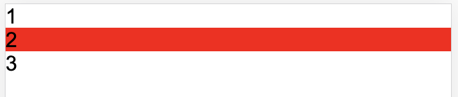
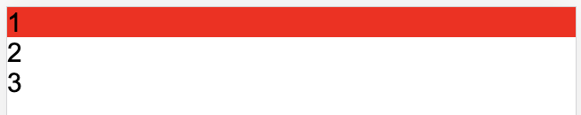

### css 选择器
- `:nth-last-child`
  ```html
    <div>
        <div class="classA">1</div>
        <div class="classA">2</div>
        <section class="classB">3</section>
    </div>
  ```
  ```css
  .classA:nth-last-child(2) {
      background-color: red;    
  }
  ```
  
- `nth-last-of-type`
  ```html
    <div>
        <div class="classA">1</div>
        <div class="classA">2</div>
        <section class="classB">3</section>
    </div>
  ```
  ```css
  .classA:nth-last-of-type(2) {
      background-color: red;    
  }
  ```
  
- 对比总结：
  - `classA:nth-last-of-type(n)` 中的 `type` 是 classA 对应的标签的类型(type), 不是类(classA)的类型(type)
  - `classA:nth-last-child(n)` 中的 `child` 是当前类选择器的父元素的倒数第 n 个子元素，且子元素的类名要是 classA , 此时元素才可以被选中 
  - `classA:nth-last-of-type(n)` 拿到 classA 的所有元素集合 A，然后去 A 集合中取倒数第 n 个子元素
  - `classA:nth-last-child(n)` 拿到 classA 的所有元素集合 A ，然后取 classA 的父元素的所有子元素得到集合 B，取 B 中的倒数第 n 个子元素 x，然后将 x 和 A 取交集(即元素 x 上有 classA 类)