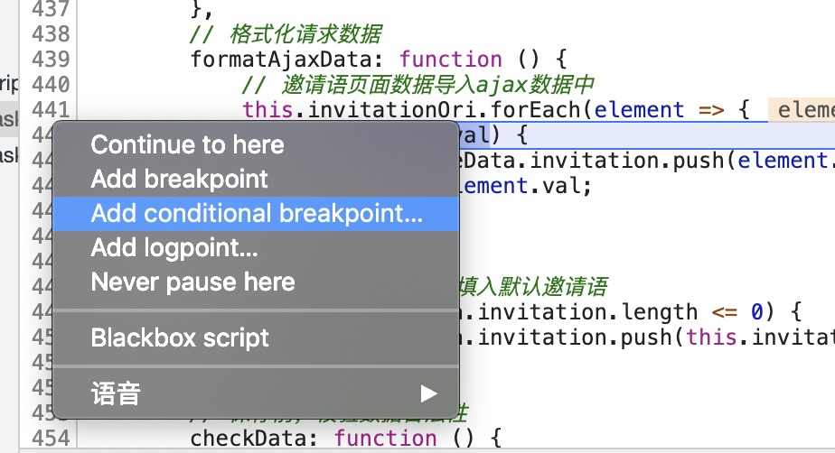

### linux 命令行
- 查看用户信息: `id warryy`
- 查看用户所属组: `groups warryy`
- 递归修改文件夹及文件夹中所有文件所属用户: `chown warryy -R folder`

### 前端
- `input[type=file]` attr
  - `accept` 接收的文件参数
  - `multiple` 是否可以多选
- XPath
  - 定义
    - js 用来选取 xml 节点的一种表达式
  - 语法
    - 路径表达式
        | 表达式     | 含义             |
        | :--------- | :--------------- |
        | `nodename` | 节点名称         |
        | `//`       | 根节点           |
        | `/`        | 子节点           |
        | `@`        | 选取属性         |
        | `..`       | 当前节点的父节点 |
        | `.`        | 当前节点         |
        | `[]`       | 谓语表达式       |
- chrome
  - `$0, $1, $2, $3, $4`
    记录你在页面上访问的最后的5个 dom 元素
  - `monitor/unmonitor`
    监听函数
  - `monitorEvents/unmonitorEvents`
    监听 dom 的各种事件
  - `$ <===> document.querySelector`
  - `$_`
  - `$$ <===> document.querySelectorAll`
  - `$x`
    通过 XPath 表达式来选择 dom 元素
  - add conditional breakpoint
    
  - 打开搜索命令面板 `C+shift+p`